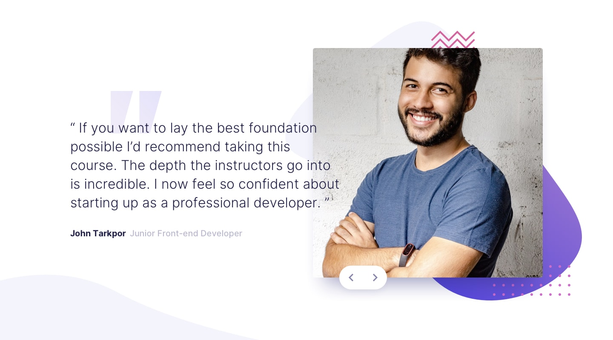
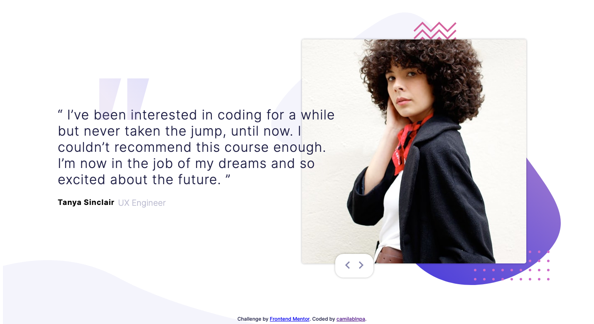
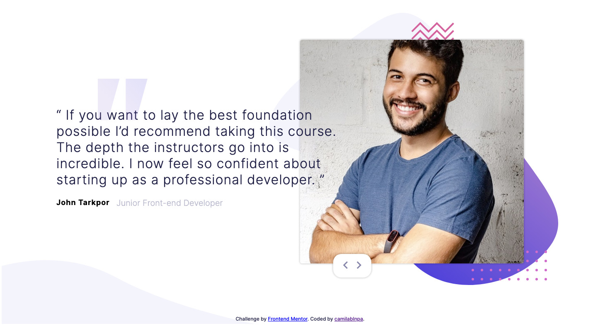
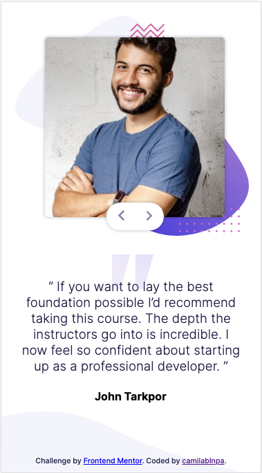

# Frontend Mentor - Coding Bootcamp Testimonials Slider

*This are the originals designs for desktop

*This are the originals designs for mobile

## Where to find everything

In the `/images` folder you will find all the required assets for the project. The assets are already optimized.

There is also a `style-guide.md` file, which contains the information you'll need, such as color palette and fonts.
In the `index.html` you will find the HTML structure for this project, in the `styles.css` you will find all the styles for this challenge and finally in the `functions.js` file you will find the simple and basic function in javascript for the arrows function. 

## Sharing your solution

If you want to see my project click [This link](https://frontendmentor-testimonials-slider-two.vercel.app/). The project was deploy with [Vercel](https://vercel.com/). 

## My results

*This are my designs for desktop*

*This are my designs for mobile*

## Giving feedback

Feedback is always welcome!
